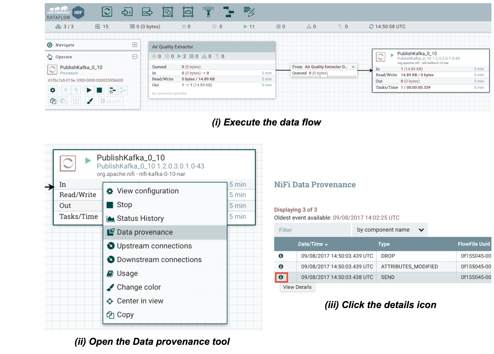

**External/legacy processes integration within NiFi flows**
=======
*Web scraping with NiFi and Scrapy via the ExecuteProcess processor*
-------
### Introduction and motivation
Web scraping is a technique used often times to extract data from websites for further processing. Many use cases  involve data extraction from web sites as a prerequisite; the following are some examples:

 - Data mining
 - Online price change monitoring and price comparison
 - Website change detection
 - Web data integration

Web scraping presents many challenges, and the complexity of the process to extract data from websites depends on the complexity of the website itself (ie. website structure, client-side frameworks, etcetera).

I tend to think of web scraping as a three-stage process:

 1. Fetching and extracting web pages containing relevant data. This step is also known as web crawling.
 2. Raw data refinement, which is all about parsing, filtering, formatting and enriching the data extracted previously. More often than not, the goal of this step is to give some format to semi-structured data coming from websites.
 3. Outcome dispatching. Based on what I’ve seen in the field, there are two typical ways of dealing with results obtained from the previous step: (1) consolidation and (2) real-time processing.
The first option is the most extended, and it allows interactive access and batch processing on top of the consolidated data. Real-time processing on extracted web data, in the other hand, is not so common as these use cases presume data acquisition from well-defined REST APIs, which it’s not the case. 

There are many powerful and production ready open source web scrapers out there, and all of them excel at stages #1 and #2. However, most of them lack of facilities for “outcome dispatching”. Not to mention that they are not meant to be part of enterprise class architectures where security and governance are a must. Here it’s where **Apache NiFi** comes to the rescue, complementing open source web scrapers to bring a solid web scraping open source and enterprise class solution.

### Scrapy 1.4
[Scrapy](https://scrapy.org/) claims to be an *“open source and collaborative framework for extracting the data you need from websites in a fast, simple, yet extensible way”*. Scrapy is a Python framework easy to install via pip, and it comes with a set of command line tools which are useful for developing and debugging.

Don’t worry if you’ve never used Scrapy, its [documentation](https://docs.scrapy.org/en/latest/index.html) is very well-written and it has an [101 tutorial](https://docs.scrapy.org/en/latest/intro/tutorial.html) to get familiarized very quickly.
#### Collecting Air Quality of main European cities
In this tutorial I’ll show you how to extract air quality data from the [“Air Quality in Europe” web site](https://www.airqualitynow.eu). Unfortunately there is not a REST API available to easily pull that data out, and data has to be extracted directly from [“Current situation” page](https://www.airqualitynow.eu/comparing_home.php) or [RSS feeds](https://www.airqualitynow.eu/rss.php):


Both resources are valid to extract the data we need, though I’ll use the first one as it gives us the information grouped by country, which will make processing easier afterwards. The “Current situation” page is going to be parsed and processed once an hour and, as a result, there will be a JSON document per city with the following schema:

```
{ country: <country_name>,
  city: <city_name>,
  roadside_idx:  <value>,
  background_idx: <value>,
  date: <yyyyMMdd>,
  hour: <0-23> }
```

#### Creating the Scrapy project to pull the data out
I’ll assume you have Scrapy already installed, otherwise check the [installation guide](https://docs.scrapy.org/en/latest/intro/install.html) and proceed accordingly. Once installed, the scrapy command line tool is available to facilitate the development and testing of **spiders**, the scripts dealing with the pages to produce to expected results:


The following 5 steps address the steps needed to accomplish our goal:

 - **Step 1.-** Start the project by using the `scrapy startproject` command; I’ll call the project **airqualitydata** and will have the following structure once it’s started:
     
 - **Step 2.-** I’ll create a spider to crawl the web page and massage the data extracted. The spider will be in the `airquality_spider.py` file within the `spiders` directory with the following contents:

```python
import scrapy
import re

class AQSpider(scrapy.Spider):
    name = "airqualitydata"
    start_urls = [ 'https://www.airqualitynow.eu/comparing_home.php' ]

    def build_datadoc (self, country, row, str_date, str_hour):

       return { 'country': country,
                'city': row.xpath("./td[@class='city_bkg1' or

                             @class='city_bkg2']/a/text()").extract_first(),
                'roadside_idx': row.xpath("./td[5]/text()").extract_first(),
                'background_idx': row.xpath("./td[9]/text()").extract_first(),
                'date': str_date,
                'hour': str_hour }

    def parse(self, response):
       country = None

       # 1. Extracting relevant sections from the page
       currentdate = response.xpath("/html/body/div/table[3]/tr/td/table[2]/tr/td[3]/table/tr[2]/td[4]/span/strong/text()").extract_first()
       tablerows = response.xpath("//*[@id='results']/tr")
       # 2. Format date accordingly to our requirements
       parsed_currentdate = re.search('([0-9]{2})/([0-9]{2})/([0-9]{4}) ([0-9]{2}):([0-9]{2})',currentdate)
       str_date = "%s%s%s" % (parsed_currentdate.group(3),
                              parsed_currentdate.group(1),
                              parsed_currentdate.group(2))
       str_hour = parsed_currentdate.group(4)
       # 3. Row by row processing; only relevant data yielded
       for row in tablerows:
          class_attr = row.xpath('@class').extract_first()
          # 2.1 Only processing useful data (first rows skipped)
          if country != None or class_attr != None:
             if class_attr != None:   # A new country starts
                country = row.xpath("./td/text()").extract_first()
                self.log("Start processing a new country: %s" % country)
             else:   # Extract city info
                 yield self.build_datadoc(country, row, str_date, str_hour)
```
 - **Step 3.-** Because of the integration with NiFi we want to address, our spider should provide results to the standard output. To do so, we need to add the following four lines at the end of the `settings.py` file:

   ```python
   FEED_FORMAT = 'jsonlines'
   FEED_URI = 'stdout:'

   LOG_LEVEL = 'ERROR'
   DOWNLOADER_CLIENT_TLS_CIPHERS = 'DEFAULT:!DH'
   ```
 
   *Update (Nov 15th 2020):* The [DOWNLOADER_CLIENT_TLS_CIPHERS](https://docs.scrapy.org/en/latest/topics/settings.html#downloader-client-tls-ciphers) property is needed due to the latest OpenSSL updates and dated web servers with weak encryption configuration ([Support for overriding OpenSSL ciphers #3442](https://github.com/scrapy/scrapy/pull/3442)).
 - **Step 4.-** Test the spider before deploying it to a NiFi cluster. To do so, we’ll use the `scrapy crawl` command, passing the name of the spider as an argument. If everything goes ok, you should get something similar to the following screenshot:
     
 - **Step 5.-** Copy the spider to every NiFi node in the cluster, this will provide an HA and scalable scenario. In order to achieve **web scraping at scale**, you might have **multiple spiders running in parallel to speed up the data extraction process**. Every spider would process a subset of the total data.
Our sample spider is very simple, deal with a small amount of data and cannot be parameterized. Anyway, I’ll copy it to the three nodes of my NiFi cluster to achieve HA as there will be only a single instance running at a given time.
It’s important to give the right permissions to the files, otherwise the NiFi node will be unable to use them. As a suggestion you might want to copy the spider under NiFi home directory (`/home/nifi`), and change the file owner to the nifi user in addition:
     

### Apache NiFi
In the introduction I mentioned that NiFi is very handy to dispatch the extracted data. As an enterprise class automation system to manage the flow of data between systems, it provides the following key features:

 - Flow management with guaranteed delivery, data buffering with back pressure and pressure release, prioritized queuing and QoS.
 - Ease of use due to its visual command and control, flow templates and data provenance.
 - Comprehensive security system to system, user to system and multi-tenant authorization.
 - Extensible architecture and site-to-site communication protocol for easy, efficient and secure interaction between NiFi nodes.
 - Flexible scaling model (up/down and out).

#### Process Group for web data extraction
This section will outline how to create a *NiFi Process Group* able to jointly work with existing Scrapy spiders properly deployed on NiFi instances. Process Groups are abstractions encapsulating the details of the data flow, and can nest additional Process Groups if needed. By having multiple Process Groups, it’s easier to build, debug and understand complex data flows without affecting the performance.

Let’s build a super simple **Process Group named “Air Quality Data Extractor”** calling our **airqualitydata spider**, and let’s connect it to a Kafka topic named `airquality` for further processing. This will involve only 5 steps:

 - **Step 1.-** Create the Process Group using the NiFi Web UI by following the steps outlined in these screenshots:
     
 - **Step 2.-** Double click the Process Group and add an ExecuteProcess processor to invoke the **airqualitydata Scrapy spider**. Look into the screenshots to understand the process.
     
     
 - **Step 3.-** Provide the Process Group with an Output Port and connect it to the ExecuteProcess Processor. This will allow other Process Groups or Processors to get extracted data from the Air Quality site:
     
    *Note that this is a very simple Process Group*, but in a real case scenario we could be interested in registering a schema in the Schema Registry component within the Process Group.
 - **Step 4.-** Exit from the Process Group, add a **PublishKafka processor** and connect both items to complete our example:
     
     
 - **Step 5.-** Execute the created data flow and check that data is extracted from the website and finally published in to the Kafka topic:
     
     

### Conclusions
This example just showcased how Apache NiFi can easily integrate itself with any external process throughout the ExecuteProcess processor. Even though the example was focused on data extraction from web sites, it can be applied to many other situations.

It’s very common to have many custom scripts or processes for very specific tasks, such as custom ETL scripts for data consolidation. You might think that in order to use NiFi to improve the automation and performance of those custom scripts, you need to migrate them all before starting. The reality is that you have the option of following the approach presented in this example in first place, and migrate those custom scripts to NiFi little by little.

### References
The following resources have been used to elaborate this article:

 - [Web scraping (wikipedia)](https://en.wikipedia.org/wiki/Web_scraping)
 - [Scrapy](https://scrapy.org/)
 - [Hortonworks HDF documentation](https://docs.hortonworks.com/HDPDocuments/HDF3/HDF-3.0.1.1/index.html)

 
